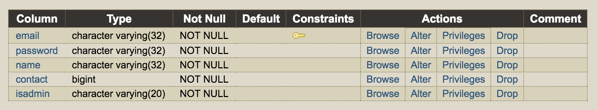

# Taskoo
Taskoo is a platform that connects taskers with available helpers. 
Below is an overview of the user flow:  
 

## Set Up
The below are screenshots of the database setup required in order to try the application:  
 
 

To access the admin panel, change the isadmin column of one of the task_users to true. 
Log in and go to '/admindashboard.php'. 

Note that as the module demo is done on a desktop browser, mobile device browsers are not supported.  

## Features

### CRUD functions & Helpers accept tasks:  
  
  
   

### Search function:  
   

## Done
- main structure / user flow of web app
- main layouts of pages
- integration with SQL database 
- simple user authentication
- task details view
- separate master-detail view that allows helper and tasker to see each other's contact details when task is accepted
- allow tasker to edit or delete pending tasks
- search function
- admin panel dashboard with CRUD functionality
- form control (error messages for user)
- conform datepickerjs date format to SQL's
